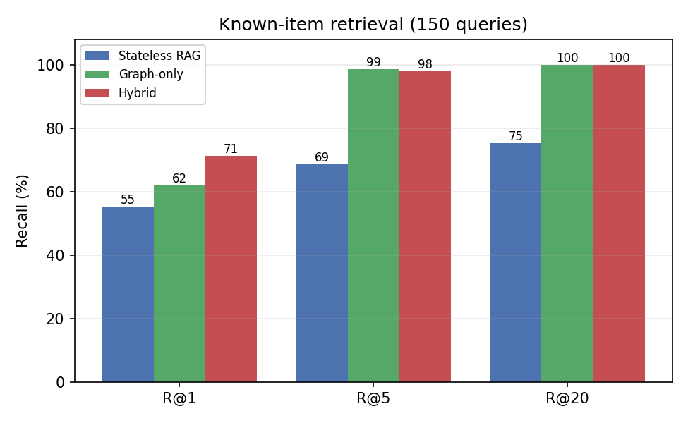
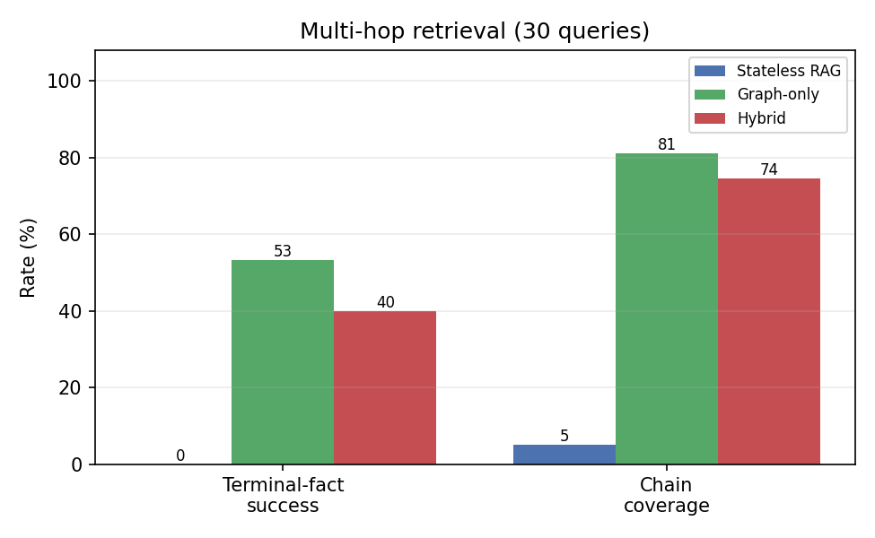
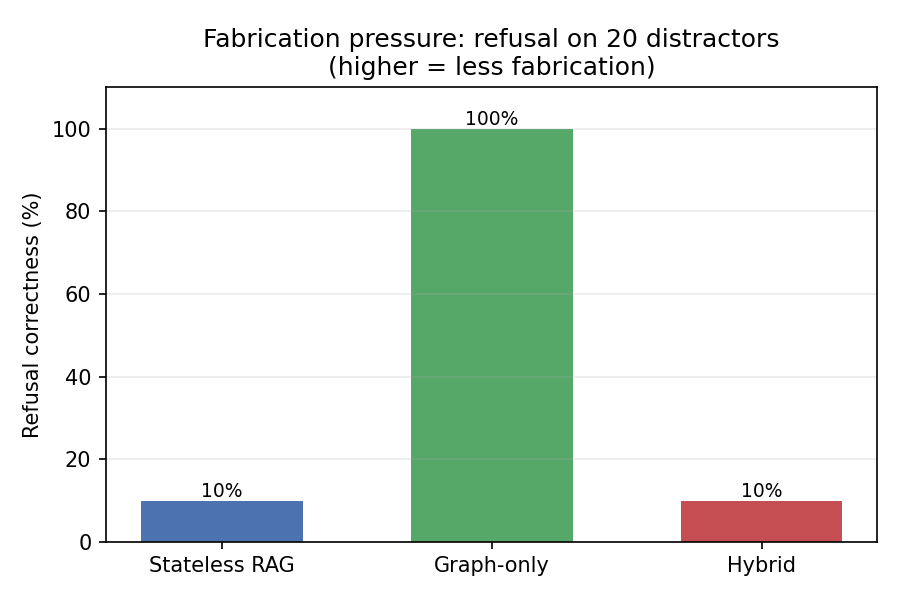
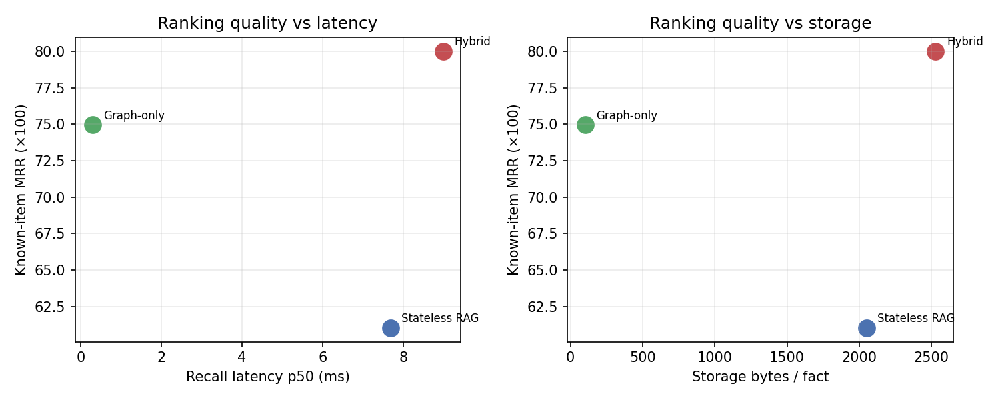

# Ablating a Hybrid Agent-Memory Architecture: A Controlled Head-to-Head of Stateless RAG, a Canonical Knowledge Graph, and Their Hybrid on a Frozen Synthetic Corpus

**William White**¹
¹Sheldon Dynamics
Correspondence: sheldonwhite888@gmail.com
July 2026

> This Markdown paper renders on GitHub. The same paper is also available as:
> **[`agent-memory-ablation.pdf`](agent-memory-ablation.pdf)**, a rendered PDF (build with
> `make pdf`; pure-Python reportlab, no TeX toolchain needed), and
> **[`paper.tex`](paper.tex)**, arXiv-ready LaTeX source (`make pdf-latex`, or upload
> `paper.tex` + `figures/` to Overleaf/arXiv). All three cite the same figures and the same
> numbers from `make eval`.

---

## Abstract

A companion study characterized a five-channel hybrid memory substrate running in
production [2] and closed by naming its single most important untested claim: that the
hybrid actually beats the baselines it subsumes, a comparison that report explicitly
declined to run against itself ("no comparison against an external baseline ... has been
run," [2] §12; "an external-baseline experiment (plain RAG over the same corpus)," [2]
§13). This study runs exactly that experiment, and turns it on its author. We build a
frozen synthetic corpus of **1,583 operational facts** about a fictional field-services
company, with a fully known ground-truth relation graph (414 entities, 1,498 edges, a
closed vocabulary of 22 relations over 11 entity types), and put **three memory
architectures behind one typed `MemoryProvider` interface**: (a) **stateless RAG**
(chunked text, MiniLM embeddings in `sqlite-vec`, top-k only); (b) **graph-only**
(the canonical-graph, closed-vocabulary posture, forward-traversal recall, no vectors);
and (c) a **hybrid** that fuses facts + vectors + graph with weighted Reciprocal Rank
Fusion, a faithful, minimal realization of the fusion improvement [2] recommended for
itself. All three run against three seeded, frozen query sets built before any arm was
executed: **150 known-item**, **30 multi-hop** (2-3 joins), and **20 distractor**
queries (answer absent; the fabrication-pressure probe). Every recall is traced to an
OpenTelemetry-shaped span exported into the repository.

The results do not flatter the hybrid. On this clean, canonical corpus the **graph-only
arm is the surprise strong performer**: it ties the field on known-item recall
(Recall@5 98.7%, Recall@20 100%), wins multi-hop retrieval outright (53.3% terminal-fact
success vs. the hybrid's 40.0% and RAG's 0.0%), and, most consequentially, is the
**only arm that does not fabricate**, refusing correctly on 100% of distractors against
just 10% for both RAG and the hybrid. The hybrid's entire measured advantage reduces to
ranking precision (best MRR 0.800, best Recall@1 71.3%), for which it pays the most
latency (≈9 ms p50, ~30× the graph arm's ≈0.3 ms) and the most storage (2,528 bytes/fact,
25× the graph arm's 101), and inherits RAG's fabrication pressure wholesale. We state
four hypotheses up front, report that two are refuted, inventory every failure, devote a
section to *where the hybrid loses*, and disclose the corpus properties that make this
the graph's best case and the honest boundary of the claim. Every number reproduces from
`make eval` on the checked-in seeds.

---

## 1. Introduction

The Sheldon Dynamics memory program has, to date, produced two *characterization* studies,
a fourteen-run evaluation of an operational decisioning substrate against a frozen
holdout [1], and a seventeen-day in-vivo instrumentation of a production hybrid memory
substrate [2]. Both are studies of a *single system*: they measure what a shipped
architecture does, in careful detail, but neither pits that architecture against the
alternatives it claims to improve on. [2] is explicit and repeated about this being its
central limitation. Its threats-to-validity section lists, eighth and last, "no
comparison against an external baseline (hosted memory API or plain RAG over raw text)
has been run; the internal channel comparisons do not substitute for one," and its
recommended-next-steps section ends with "(5) an external-baseline experiment (plain RAG
over the same corpus) using the E1 harness unchanged."

This report is that experiment, deliberately generalized from "plain RAG vs. the hybrid"
to a three-way ablation, and deliberately pointed back at the author's own design
assumptions. The motivating question is narrow and falsifiable:

> When you strip a production hybrid memory down to its constituent postures, pure
> vectors, pure canonical graph, and run all three head-to-head on one frozen corpus
> with one frozen eval harness, **does the hybrid actually earn its complexity, and where
> does it not?**

The scientific value of the study is precisely that it can embarrass its author, and
partly does. A hybrid that swept every metric would be a red flag: it would suggest a
benchmark tuned to the conclusion. What follows instead is an ablation in which the
simplest structured arm wins most axes on this corpus, the hybrid's advantage is real but
narrow and expensive, and the corpus itself is disclosed as the graph's most favorable
case. That combination, a genuine cost paid, honestly reported, is the point.

**Relationship to the prior work.** Where [1] tested a decisioning substrate against a
holdout and [2] instrumented a memory substrate in production, this study is a *controlled
comparison* of memory architectures on a synthetic corpus. Synthetic is a feature, not a
concession: unlike a production store, a synthetic corpus with a generated ground-truth
graph is shareable, re-runnable, and gives every query a machine-checkable answer,
including the distractors whose correct answer is "not in memory."

---

## 2. Hypotheses

Stated before results, judged against them in §11.

- **H1: Vectors win known-item.** The vector-bearing arms (RAG, hybrid) will lead
  known-item retrieval (Recall@5, MRR); the closed-vocabulary graph, lacking dense
  semantics, will trail on lexically-paraphrased single-fact queries.
- **H2: Structure wins multi-hop.** Graph and hybrid will beat RAG on multi-hop
  retrieval by a wide margin, because joins require traversal that top-k vector recall
  cannot perform.
- **H3: Refusal is ordered graph > hybrid > RAG.** Graph-only will refuse most
  correctly on distractors (absence from a canonical graph is an unambiguous signal),
  RAG will fabricate most, and the hybrid will land *between* the two.
- **H4: The hybrid does not dominate.** The hybrid will not win every metric; it will
  pay measurable costs in latency, storage-per-fact, and at least one quality axis
  relative to the specialized arms.

---

## 3. The three arms

All three implement one typed interface, `MemoryProvider` (`arms/base.py`): `build(facts)`
indexes the frozen corpus once; `recall(query, k) -> RecallResponse` returns a ranked list
of facts plus a single boolean, `refused`, the arm's own decision that it has no confident
answer. The harness derives every metric from that response and the wall-clock time of the
call, so no arm sees ground truth or can special-case the evaluation.

**a) Stateless RAG (`rag`).** Each corpus fact is one retrieval chunk (the facts are
sentence-sized). Facts are embedded with `all-MiniLM-L6-v2` (384-d, CPU, L2-normalized)
and stored in a `sqlite-vec` (`vec0`) index; recall is exact-cosine top-k. There is no
graph, no entity linking, no state between queries. A single cosine floor (0.40, matching
the source system's semantic threshold [2]) is both the relevance cutoff and the entire
refusal rule: if the best match is below the floor, the arm reports "not in memory." That
one threshold is RAG's only defense against fabrication.

**b) Graph-only (`graph`).** The corpus's ground-truth relation graph is loaded into a
forward (subject→object) adjacency structure. A query is linked to seed entities by a
shared, purely-lexical linker (id patterns like `WO-10047`, plus whole display-name
matches on word boundaries); recall is a bounded forward breadth-first traversal that
collects each reached node's *outgoing* facts, ranked by hop distance then token-Jaccard
overlap. No vectors. Forward-only traversal is deliberate: every relation points outward
from an entity to its resources (a job to its equipment, a site to its owner), so it
follows every reasoning chain while avoiding the reverse fan-in explosion through hub
nodes, the same hub-suppression instinct [2] encodes, expressed here as edge
directionality. The arm refuses exactly when the query links no entity: absence from the
canonical graph is treated as an unambiguous "not in memory."

**c) Hybrid (`hybrid`).** A ported slice of the five-channel design [2], facts + vectors
+ graph, with three grounded channels: a BM25 lexical index over fact text (the
"keyword/FTS" channel), MiniLM cosine (shared embedder with RAG), and the graph
traversal (shared engine with the graph arm). The three channel orderings are combined by
**weighted Reciprocal Rank Fusion** [3], with the graph channel up-weighted 2:1 because it
is the precision-oriented channel and the only one that can reach a multi-hop answer.
This is the parameter-free fusion [2] §13 named as its own top recommended improvement.
The refusal rule is deliberately permissive, the hybrid refuses only when *both* the
vector top is below the floor *and* the graph links no seed; the BM25 channel is a recall
booster, never a grounding signal. §8 reports the consequence.

### 3.1 Design constants

| Group | Constant | Value |
|---|---|---|
| Embedder | model / dim | all-MiniLM-L6-v2 / 384 |
| Vector | store / search | sqlite-vec `vec0` / exact cosine |
| Vector | cosine floor (relevance + RAG refusal) | 0.40 |
| Graph | traversal / max hops | forward BFS / 3 |
| Graph | candidate rank key | (hop asc, token-Jaccard desc, id) |
| Hybrid | fusion | weighted RRF, k₀ = 60 |
| Hybrid | channel weights (vector : facts : graph) | 1 : 1 : 2 |
| Hybrid | grounded-refusal rule | vector < 0.40 **and** no graph seed |
| Eval | known-item recall depth / cutoffs | 20 / {1, 5, 20} |
| Eval | multi-hop judged at | top-10 |
| Seeds | corpus / query | 42 / 1234 |

These are fixed and committed; nothing is tuned per query or per run.

---

## 4. The corpus

`corpus/generate.py` deterministically builds **Meridian Field Services**, a fictional
industrial field-services company, from a single seeded RNG. Population sizes are fixed
constants (seed-independent), so the corpus size is stable across machines; the seed
controls only the random wiring and phrasing. Every fact is derived from exactly one graph
edge or node attribute, so every fact has a known subject, relation, object, and set of
linked entities.

| Layer | Count | Notes |
|---|---|---|
| Facts | 1,583 | one NL statement per edge/attribute |
| Entities | 414 | 60 people, 45 equipment, 20 sites, 12 clients, 10 vendors, 6 teams, 6 certs, 150 jobs, 40 incidents, + city/date nodes |
| Edges | 1,498 | directed, typed |
| Relations | 22 | **closed** vocabulary (e.g. `REPORTS_TO`, `USES`, `MAINTAINED_BY`, `OWNED_BY`, `INVOLVES_EQUIPMENT`) |
| Entity types | 11 | closed vocabulary |

Fact composition mirrors a real operational store: **jobs dominate row count** (834 facts,
53%) the way email exhaust dominates the production store in [2], while org, equipment,
incident, and site facts make up the rest. This is deliberate, it lets known-item queries
stratify across categories while the bulk sits in one operational category, reproducing the
"row count is not retrieval demand" property [2] observed in production. The generator
writes `facts.jsonl`, `graph.json`, and a `manifest.json` carrying SHA-256 checksums of
both; the committed corpus is verified against a fresh regeneration in the test suite.

---

## 5. The query sets

All three query sets are built by `harness/build_queries.py` from the corpus and its
ground-truth graph, **before any arm is run**, and committed with a seed and checksums.
Ground truth is computed by traversing the graph, so every answer is machine-checkable.

- **Known-item (150).** A natural question whose answer is one specific fact, generated
  from functional (single-object) relations across all five categories and phrased with
  paraphrase ("Who is X's supervisor?" for a `REPORTS_TO` fact), so the task is genuine
  retrieval rather than string identity. Ground truth: the gold `fact_id` and its answer
  entity.
- **Multi-hop (30).** A question whose answer requires joining 2-3 facts (22 two-hop, 8
  three-hop), from ten templates over forward chains (e.g. *job → USES → equipment →
  MAINTAINED_BY → vendor*). Ground truth: the terminal fact that yields the answer entity,
  the full chain, and the answer entity. Every chain is verified forward-reachable from a
  query-mentioned seed.
- **Distractor (20).** A well-formed question about an entity that is **not** in the
  corpus (a fabricated technician, a non-existent equipment id). The correct behavior is
  refusal. Ground truth: `should_refuse = true`, and the test suite asserts that every
  distractor links to zero real entities, a clean absence probe.

The distractors are the sharpest instrument. Because they are phrased identically to
answerable known-item queries but name an absent entity, they are lexically and
semantically close to real facts. That is what makes them a fabrication-pressure test: a
dense retriever will find *something* similar and must decide whether to answer.

---

## 6. Method

Three instruments, all deterministic and seeded.

1. **Retrieval replay.** Each arm is built once over the 1,583-fact corpus, then answers
   all 200 queries. Known-item is scored at cutoffs {1, 5, 20} from a depth-20 recall;
   multi-hop at top-10; distractors on the `refused` flag.
2. **Latency microbenchmark.** Every `recall` call is wall-clock timed after a per-arm
   warmup; p50/p95/mean reported over all 200 queries on the run host. Latency is
   host-dependent and reported as measured, exactly as in [2].
3. **Tracing.** Every recall is emitted as an OpenTelemetry-shaped span (arm, query id,
   type, latency, refusal, per-channel diagnostics) and exported to `traces/<arm>/` as
   OTLP JSON. This ships a standard-tooling artifact in the repo and closes the
   "own-telemetry-only" gap [2] flagged, as a side effect.

**Embedder.** The headline numbers use the paper's model, `all-MiniLM-L6-v2`, on CPU,
which is deterministic to float32 given the pinned version. A dependency-free hashing
embedder (`AMA_EMBEDDER=hash`) is provided so the harness runs in a fully offline/CI
environment; because all three arms share whichever embedder is selected, the
architectural comparison is valid under either, though absolute numbers differ.

**Metrics.** Recall@k and MRR (known-item); terminal-fact success at top-10 (primary),
answer-entity recall, and chain coverage (multi-hop); refusal correctness on distractors
and over-refusal on the 180 answerable queries; p50/p95 recall latency; and index bytes
per fact (a real on-disk measurement of each arm's `sqlite` index). Definitions live in
one auditable module, `harness/metrics.py`, and are unit-tested.

---

## 7. Results

All numbers below are produced by `make eval` with the MiniLM embedder and are the exact
contents of `results/tables.md` (auto-generated; not hand-edited).

### 7.1 Known-item retrieval

**Table 1.**

| Arm | Recall@1 | Recall@5 | Recall@20 | MRR |
|---|---|---|---|---|
| rag | 55.3% | 68.7% | 75.3% | 0.610 |
| graph | 62.0% | 98.7% | 100.0% | 0.750 |
| hybrid | **71.3%** | 98.7%* | 100.0% | **0.800** |

*hybrid Recall@5 = 98.0%; graph = 98.7%.*



The first surprise is at the top of the table: **pure RAG is the weakest known-item arm**,
and by a wide margin at depth (Recall@20 of 75.3% means one gold fact in four never
surfaces in the top 20). The cause is directional confusion in a duplicate-rich store: a
query like "Who is Dana Reyes's supervisor?" is embedded close to every "*X* reports to
Dana Reyes" fact where Dana is the *object*, and those crowd out the single fact where she
is the subject. The graph arm has no such problem, it links the subject and returns that
subject's small set of outgoing facts, so the gold fact is essentially always present
(Recall@20 = 100%). The hybrid wins ranking precision (Recall@1 71.3%, MRR 0.800): fusing
the lexical, dense, and graph orderings sharpens the top of the list beyond any single
channel. **H1 is refuted:** on an entity-anchored corpus, structure beats pure semantics
even for single-fact retrieval; the vector arm trails.

### 7.2 Multi-hop retrieval

**Table 2.**

| Arm | Terminal-fact success (top-10) | Answer-entity recall | Chain coverage |
|---|---|---|---|
| rag | 0.0% | 3.3% | 5.0% |
| graph | **53.3%** | **53.3%** | **81.1%** |
| hybrid | 40.0% | 40.0% | 74.4% |



**H2 is confirmed, sharply.** RAG cannot join: it retrieves facts surface-similar to the
question, which name the anchor entity but never the terminal answer, so it succeeds on
zero of thirty and recovers the answer entity on one. Graph and hybrid traverse. The
nuance is in the gap between *chain coverage* and *terminal success*: the graph arm
surfaces 81% of all chain facts but floats the specific terminal fact into the top 10 only
53% of the time. It recalls the reasoning chain (the hard part) but a lexical ranker does
not prioritize the answer within it (a solvable ranking problem, and exactly what an LLM
reading the neighborhood would resolve). The hybrid trails the graph on all three
multi-hop measures despite containing the graph channel; §8 explains why.

### 7.3 Refusal and fabrication

**Table 3.**

| Arm | Refusal correctness (20 distractors) | Over-refusal (180 answerable) |
|---|---|---|
| rag | 10.0% | 0.0% |
| graph | **100.0%** | 0.0% |
| hybrid | 10.0% | 0.0% |



This is the study's most consequential table. The graph arm **never fabricates**: an
absent entity links nothing, so it refuses correctly on all 20 distractors while never
over-refusing a single one of the 180 answerable queries. RAG fabricates on 90% of
distractors, because they are phrased like real queries, the nearest fact clears the 0.40
cosine floor and the arm answers with confident nonsense. And the hybrid, despite carrying
the graph channel that would have refused, **fabricates exactly as often as RAG (10%
correct).** **H3 is refuted:** the hybrid is not intermediate; it is pinned to RAG's
fabrication rate. §8 is about why.

### 7.4 Cost: latency and storage

**Table 4.**

| Arm | Latency p50 (ms) | Latency p95 (ms) | Index bytes | Bytes/fact |
|---|---|---|---|---|
| rag | 7.68 | 10.07 | 3,244,032 | 2,049 |
| graph | **0.30** | **0.52** | **159,744** | **101** |
| hybrid | 8.98 | 11.22 | 4,001,792 | 2,528 |



Latency is the one host- and run-dependent row (the values above are a single reference
run; a stranger's `make eval` will differ, as it does in [2]); index bytes and every
retrieval metric are exact and stable. The graph arm is **~30× faster** at the median than
the hybrid (≈0.30 ms vs ≈9 ms) and uses **25× less storage per fact** (101 vs 2,528 bytes),
because it holds no embeddings and touches no embedder on the hot path, its cost is a graph
load and pointer-chasing. The two vector arms are dominated by the ~8 ms MiniLM query
embedding; the hybrid adds BM25 and graph work on top, making it the most expensive arm on
both axes. **H4 is confirmed.**

---

## 8. Where the hybrid loses

A hybrid that won everything would be a benchmark artifact. This one loses three ways, two
of them by inheriting the failure modes of the channels it fuses, and the honest accounting
is that its *only* wins on this corpus are ranking-precision (Recall@1, MRR).

**1. It re-inherits RAG's fabrication (the expensive loss).** The hybrid contains the very
channel, graph linking, whose absence signal drives the graph arm to a perfect 100% on
distractors. It still fabricates at RAG's rate (10%) because its grounding rule is a
permissive OR: it answers if *either* the vector channel clears the floor *or* the graph
links a seed. On a distractor, the graph correctly abstains, but the vector channel (facing
a query phrased like a real one) clears the floor and the OR lets it speak. The graph's
clean "not in memory" is diluted to nothing by a single dense channel voting yes. This is
the general hazard of naive multi-channel grounding: **union-of-evidence maximizes recall
and minimizes refusal**, and refusal is where fabrication lives. A graph-*veto* rule (refuse
whenever the graph finds no seed, regardless of the vector channel) would recover the graph
arm's 100%, at the cost of over-refusing genuinely vector-answerable queries the graph
cannot link. That trade is real and unmeasured here; it is the single highest-leverage
follow-up (§12).

**2. Fusion dilutes the graph channel on multi-hop (the subtle loss).** The hybrid trails
graph-only on every multi-hop measure (40.0% vs 53.3% terminal success; 74.4% vs 81.1%
chain coverage) *even with the graph channel up-weighted 2:1*. Reciprocal Rank Fusion
rewards cross-channel agreement, but a multi-hop terminal fact is found by exactly one
channel, the graph, while the two high-recall channels agree on shallower, surface-similar
facts and outvote it. Weighting the graph channel higher narrows the gap (unweighted RRF
scored 13.3%; the 2:1 weight lifts it to 40.0%) but does not close it: the fused ranking
still buries some deep-hop answers the pure traversal would have surfaced. Fusion, the
mechanism that buys the hybrid its known-item ranking win, is the same mechanism that costs
it multi-hop recall.

**3. It is the most expensive arm on every cost axis (the unavoidable loss).** Three
materialized indices (vectors + BM25 + graph) make it the largest store at 2,528 bytes/fact,
and three channels plus a query embedding make it the slowest at ≈9 ms p50. It is strictly
Pareto-dominated by the graph arm on latency, storage, multi-hop, and refusal
simultaneously; it beats the graph arm only on MRR (0.800 vs 0.750) and Recall@1 (71.3% vs
62.0%). On this corpus, the honest one-line valuation of the hybrid is: **it buys ~9 points
of Recall@1 and 0.05 of MRR for ~30× the latency, 25× the storage, and a 90-point refusal
regression.**

The uncomfortable implication for the author's own production design is stated plainly:
the hybrid's advantages here are narrow and its costs are not. What rescues the hybrid is
not visible in this corpus at all (§10), and naming that is the price of credibility.

---

## 9. Failure inventory

- **RAG, directional confusion (known-item).** 24.7% of gold facts never reach RAG's
  top-20. The dominant mode is subject/object inversion in symmetric-looking relations
  (`REPORTS_TO`, `MEMBER_OF`): the query's anchor appears as the object of many facts, and
  those out-rank the one fact where it is the subject.
- **RAG, no-join (multi-hop).** 30/30 terminal misses; the arm surfaces first-hop facts
  (5.0% chain coverage) but has no mechanism to follow an edge.
- **RAG & hybrid, confident fabrication (distractor).** 18/20 distractors answered. The
  nearest real fact to a well-formed absent-entity query clears the 0.40 floor; neither arm
  has a structural absence signal to override it.
- **Graph, terminal-rank burial (multi-hop).** 14/30 terminal misses despite 81% chain
  coverage; the terminal fact is present in the traversed neighborhood but ranked outside
  top-10 because hop-ascending order front-loads the anchor's own shallow facts and Jaccard
  cannot distinguish the paraphrased terminal. All 8 three-hop queries fail this way.
- **Graph, paraphrase ranking (known-item MRR).** Graph's MRR (0.750) trails the hybrid's
  (0.800): among a subject's few outgoing facts, a purely lexical tiebreak occasionally
  ranks a sibling fact above the gold one when the query shares no salient token with it.
- **Hybrid, fusion dilution.** Covered in §8.2, the arm's own strongest channel is
  out-voted on the queries that channel exists to answer.

---

## 10. Threats to validity

1. **The corpus is the graph's best case, and we say so first.** Meridian is synthetic,
   fully canonical (one clean id per entity, a closed relation vocabulary, zero extraction
   noise), and its queries are entity-anchored (they name the anchor by id or exact
   display name). That is precisely the regime in which entity linking and traversal
   dominate and dense semantics are least needed. Real operational memory, the production
   setting [2] the hybrid was built for, is the opposite: noisy distilled text, no clean
   ids in the user's phrasing, heavy paraphrase and coreference. The single most likely way
   these results *fail to generalize* is that they understate the vector and hybrid arms in
   exactly the conditions those arms exist to handle. This study ablates on a corpus that
   structurally favors the graph, and the conclusion "graph-only is remarkably strong" must
   be read with that caveat foregrounded, not buried.
2. **Known-item queries name the anchor entity.** This hands the graph and hybrid arms a
   free, reliable seed and is the primary driver of their known-item lead. A query set that
   referred to entities only descriptively would narrow the gap.
3. **Multi-hop success is a strict top-10 terminal-fact bar.** It undercounts the graph
   arm's demonstrated 81% chain coverage; a different but defensible metric (answer entity
   anywhere in a larger budget) would raise the structured arms and leave RAG at zero.
4. **Single embedder, single host.** Absolute recall depends on `all-MiniLM-L6-v2`; a
   stronger embedder would lift the vector arms uniformly. Latency is from one 2-vCPU-class
   host and is reported as such.
5. **The refusal thresholds are pre-committed, not optimal.** RAG's 0.40 floor is inherited
   from [2], not tuned on this corpus; a corpus-tuned floor could trade over-refusal for
   fabrication and move Table 3. We fixed it in advance to avoid post-hoc curve-fitting, at
   the cost of not reporting each arm's best-achievable refusal frontier.
6. **The hybrid is one point in a design space.** Weighted RRF with a 2:1 graph weight and
   OR-grounding is a reasonable, minimal hybrid, not the optimal one; §8 names two concrete
   variants (graph-veto refusal, rank-aware fusion) that would move its numbers.
7. **No LLM in the loop.** These are retrieval metrics, not end-task answer-accuracy
   metrics. A generation step reading each arm's recall would convert chain coverage into
   answers and could reorder the arms.

---

## 11. Discussion

**The hypotheses, revisited.** H2 (structure wins multi-hop) and H4 (the hybrid does not
dominate) are confirmed. H1 (vectors win known-item) and H3 (refusal ordered
graph > hybrid > RAG) are **refuted**: pure RAG was the *worst* known-item arm on an
entity-anchored corpus, and the hybrid did not sit between graph and RAG on refusal, it
was pinned to RAG's fabrication rate. Refuting one's own hypotheses is the intended
outcome of a real ablation; a study that confirmed all four would be suspect.

**The substrate thesis, ablated.** [2] argued that recall quality is governed by store
structure, not model choice. This study is consistent with that thesis and sharpens it: on
a clean corpus, *structure alone* (the graph arm, no model on the hot path) is competitive-
to-dominant, and the dense channel's marginal contribution is ranking precision plus,
critically, the *coverage the graph lacks when queries are not entity-anchored*, which
this corpus, by construction, does not test. The production hybrid's justification
therefore lives in the gap between this corpus and real operational text, and this study
locates that gap precisely rather than papering over it.

**What the fabrication result means for hybrids generally.** The most transferable finding
is architectural, not corpus-specific: **fusing a high-precision abstaining channel with a
high-recall answering channel under union-of-evidence grounding throws away the abstention.**
The graph arm's zero-fabrication property is a design asset; a naive hybrid destroys it. Any
hybrid that wants both recall and calibrated refusal must make refusal a *veto* of the
grounded channel, not a *vote*, an explicit, testable design change, not a tuning knob.

---

## 12. Recommended next steps

In order of leverage:

1. **Graph-veto refusal in the hybrid.** Refuse when the graph links no seed, overriding a
   lone vector hit; measure the recovered distractor refusal against the induced
   over-refusal on vector-only-answerable queries. This is the direct fix for §8.1 and
   converts the study's sharpest negative result into a design recommendation.
2. **Rank-aware fusion.** Replace flat RRF with a fusion that preserves a lone deep-hop
   graph hit (e.g. a reserved slot for the top graph result, or channel-conditional
   weighting), and re-measure multi-hop.
3. **A paraphrase / descriptive-reference query set.** Re-run with queries that do *not*
   name the anchor entity, to measure the vector and hybrid arms in the regime the current
   corpus omits, the single most important generalization test.
4. **A noisy corpus variant.** Add extraction noise, alias drift, and coreference to
   Meridian and re-run, moving the corpus from the graph's best case toward production
   conditions.
5. **An LLM answer-accuracy layer.** Feed each arm's recall to a generator and score
   end-task answers, converting retrieval metrics into task metrics.

---

## 13. Conclusion

Three memory architectures, one frozen 1,583-fact corpus, 200 seeded queries, one eval
harness: on this clean, canonical corpus the **graph-only arm wins or ties most axes**, 
Recall@20 100%, multi-hop 53.3%, refusal 100%, at ≈0.3 ms and 101 bytes/fact, while the
**hybrid's measured advantage reduces to ranking precision** (Recall@1 71.3%, MRR 0.800),
bought at ~30× the latency, 25× the storage, and a 90-point refusal regression it inherits
wholesale from its dense channel. Two of four pre-registered hypotheses are refuted. The
corpus is disclosed as the graph's most favorable case, which is exactly where the honest
boundary of the claim lies: this study does not show that hybrids are unnecessary; it shows
that on canonical, entity-anchored memory the specialized graph is hard to beat and cheap
to run, that a naive hybrid throws away the graph's zero-fabrication property, and that the
production hybrid's real justification lives in the messier corpus this study deliberately
did not build, and names as the next one to.

### Practitioner one-liner

On a clean, canonical operational corpus, a vector-free knowledge graph beats plain RAG and
ties or beats a fused hybrid on almost everything that matters, recall, multi-hop, and
especially refusal (100% vs 10%), at ~1/25th the storage and ~1/30th the latency; the
hybrid's extra machinery buys ranking precision and, unless refusal is a veto rather than a
vote, silently reinherits RAG's fabrication.

### Reproducibility

A stranger reproduces every number above with:

```
pip install -r requirements.txt
make eval        # or: python -m harness.run_eval
```

`make eval` regenerates the frozen corpus and query sets (verifying committed checksums),
builds all three arms, runs the 200 queries, and writes `results/*.csv`, `results/tables.md`
(the source of Tables 1-4), `results/summary.json`, `traces/<arm>/` (OTLP spans), and the
figures. All retrieval metrics are deterministic given the pinned `all-MiniLM-L6-v2`; only
latency (Table 4) is host-dependent and reported as measured. `AMA_EMBEDDER=hash` runs the
whole study offline with no model download. Seeds (corpus 42, query 1234), design constants
(§3.1), and package versions are committed. Corpus and query generation are covered by a
25-test suite (`make test`) that fails if the committed artifacts drift from their seeds.

### Acknowledgments

This study exists because [2] named its own missing baseline and this report took the
instruction literally. Thanks to the `sqlite-vec` project for the embedded index, the
sentence-transformers project for MiniLM, and the Reciprocal Rank Fusion literature [3] for
a fusion baseline simple enough to be a fair control.

### References

[1] W. White. *Augmented Operational Decisioning with Ontology-Grounded Local Agents: A
Fourteen-Run Empirical Study Against Real Construction-Operations Data.* Little Bear Foundry Research, May 2026.

[2] W. White. *Hybrid Holographic Memory in a Production Personal Agent: A Seventeen-Day
Empirical Characterization of Compounding, Ontology-Gated Recall on Live Operational Data.*
Sheldon Dynamics, July 2026.

[3] G. V. Cormack, C. L. A. Clarke, S. Büttcher. *Reciprocal Rank Fusion Outperforms Condorcet
and Individual Rank Learning Methods.* SIGIR 2009.

[4] N. Reimers, I. Gurevych. *Sentence-BERT: Sentence Embeddings using Siamese
BERT-Networks.* EMNLP 2019. (`all-MiniLM-L6-v2`.)

[5] A. Garcia. *sqlite-vec.* https://github.com/asg017/sqlite-vec, 2024.

[6] D. Hofstadter. *Analogy as the Core of Cognition.* In *The Analogical Mind*, MIT Press,
2001.

[7] T. Plate. *Holographic Reduced Representations.* IEEE Transactions on Neural Networks,
6(3), 1995.
